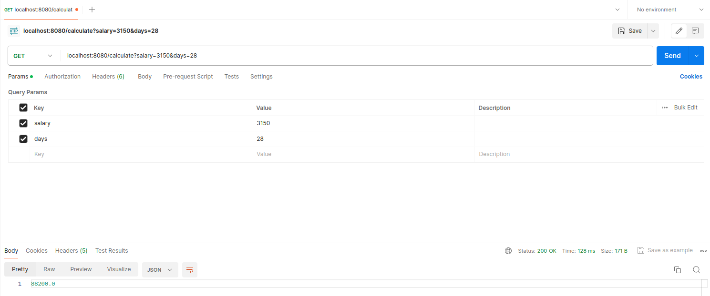
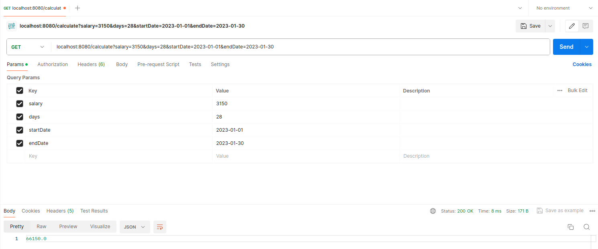

# VacationPayCalculator

Приложение "Калькулятор отпускных".  
Микросервис на Spring Boot + Java 21 c одним API: GET "/calculacte"  
  
Приложение принимает твою среднюю зарплату за 12 месяцев и количество дней отпуска - отвечает суммой отпускных, которые придут сотруднику.  
Доп. задание: При запросе также можно указать точные дни ухода в отпуск, тогда должен проводиться рассчет отпускных с учётом праздников и выходных.
Также написаны юнит-тесты.

# Cтек проекта
Spring Boot  
Java 21  
Gradle   
JUnit  
Mockito

# API requests
Простой запрос:  
`http://localhost:8080/calculate?salary=3150&days=28` 
  
Запрос с указанием точного дня ухода в отпуск:  
`http://localhost:8080/calculate?salary=3150&days=28&startDate=2023-01-01&endDate=2023-01-30`

# Postman

